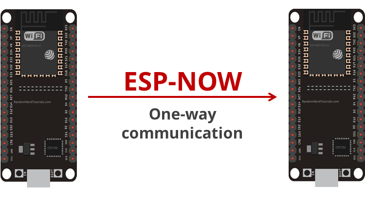

# ESPNOW - WiFi

**table of content**
- [ESPNOW - WiFi](#espnow---wifi)
  - [How ESP-Now works](#how-esp-now-works)
  - [get MAC](#get-mac)
  - [One Way communication](#one-way-communication)


## How ESP-Now works
Esp now is a communication protocol that uses WiFi to communicate directly between two or more ESP boards. This communication protocol is limited to a maximum of 250 Bytes per message. 

Helpful links:
https://randomnerdtutorials.com/esp-now-esp32-arduino-ide/

## get MAC
to communicate from one esp to another you need to get the MAC address of the receiving ESP. You can get the MAC address by uploading this code: (also found in the ESPNow/ESP-Get-MAC folder)

```c++
#include "WiFi.h"
 
void setup(){
  Serial.begin(115200);
  WiFi.mode(WIFI_MODE_STA);
  Serial.println(WiFi.macAddress());
}
 
void loop(){

}
```

## One Way communication

<br>
The data that gets send and received by the ESPs has to be in a struct container that needs to be the same on the sending and receiving end.
<br>
<br>

Example:
```c++
typedef struct struct_message
{
  char a[32];
  int b;
  float c;
  bool d;
} struct_message;
 ```
