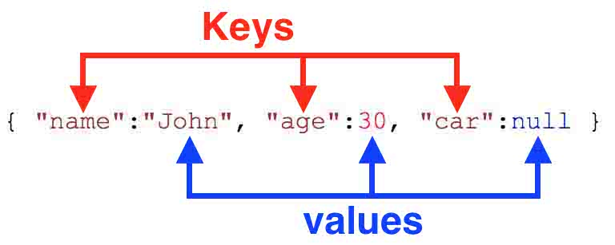

# USART

**table of content**
- [USART](#usart)
  - [Description](#description)
  - [How to connect](#how-to-connect)
  - [JSON Document](#json-document)
    - [JSON helping links](#json-helping-links)

## Description
USART stands for Universal Synchronous Asynchronous Receiver Transmitter. <br>

USART communication involves two essential pins, commonly referred to as TX (transmit) and RX (receive). These pins facilitate bidirectional data transfer, where one device's TX pin connects to the other device's RX pin and vice versa. <br>

## How to connect


<br>

## JSON Document
So, in simple terms, JSON is a way to write down information for computers using labels and values, making it easy for them to work with data and share it with other programs.  <br>

JSON helps you organize data in a structured way. You can make groups of these key-value pairs to represent bigger pieces of information. For instance, you can organize details about a person:
```json
{
  "name": "John",
  "age": 30,
  "isStudent": false,
  "hobbies": ["Reading", "Gaming"]
}
```

for Java users: it is simmilar to an "Object"

For e.g: 


### JSON helping links
More information at: 
- https://arduinojson.org
- https://randomnerdtutorials.com/decoding-and-encoding-json-with-arduino-or-esp8266/